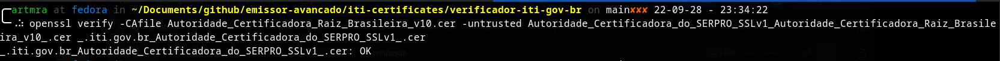

### COMO OBTER OS CERTIFICADOS DOS SERVIDORES

Salve todos os certificados mostrados pela execução do comando abaixo:

```shell
openssl s_client -showcerts -connect <DOMINIO_BASE_SEM_PROTOCOLO>:443
```

Um exemplo de valor para DOMINIO_BASE_SEM_PROTOCOLO é `pbad.labsec.ufsc.br`.

```shell
openssl s_client -showcerts -connect pbad.labsec.ufsc.br:443
```

Em alguns casos(como o do comando acima) a execução do comando pode não retornar todos os certificados da cadeia.
Nesse caso salve o certificado do site(o certificado de profundidade 0)
e obtenha cada um dos certificados da cadeia pelos links contidos na extensão
`Authority Information Access(oid: 1.3.6.1.5.5.7.1.1)` do
certificado; utilize o link associado ao Access Method `CA Issuers (oid: 1.3.6.1.5.5.7.48.2)`.
Utilizar o [KeyStore Explorer](https://keystore-explorer.org/downloads.html) pode ajudar.

Com todos os certificados necessários obtidos execute o seguinte comando para verificar a cadeia:

```shell
openssl verify -CAfile <CERTIFICADO_AC_RAIZ>.cer -untrusted <CERTIFICADO_AC_INTERMEDIARIA_1>.cer <CERTIFICADO_FINAL>.crt
```

Se os certificados estiverem corretos será obtido um output semelhante a esse:




Agora basta adicionar os certificados a keystore do jdk em uso. O [JDK padrão](https://docs.oracle.com/cd/E37670_01/E36387/html/ol_keytool_sec.html) do linux geralmente se encontra em
`/etc/pki/java/cacerts`.